# DiskyCache Operations

This document provides detailed sequence diagrams and operation flows for DiskyCache functionality with comprehensive indexing and flexible configuration.

## Core Operations Overview

The cache system operates through several key workflows that handle data storage, retrieval, cleanup, health monitoring, and multi-dimensional searching with sub-millisecond performance. The system now supports comprehensive configuration management with method overloading and no magic numbers.

## Configuration Operations

### Constructor Initialization Flow (Configuration Object)

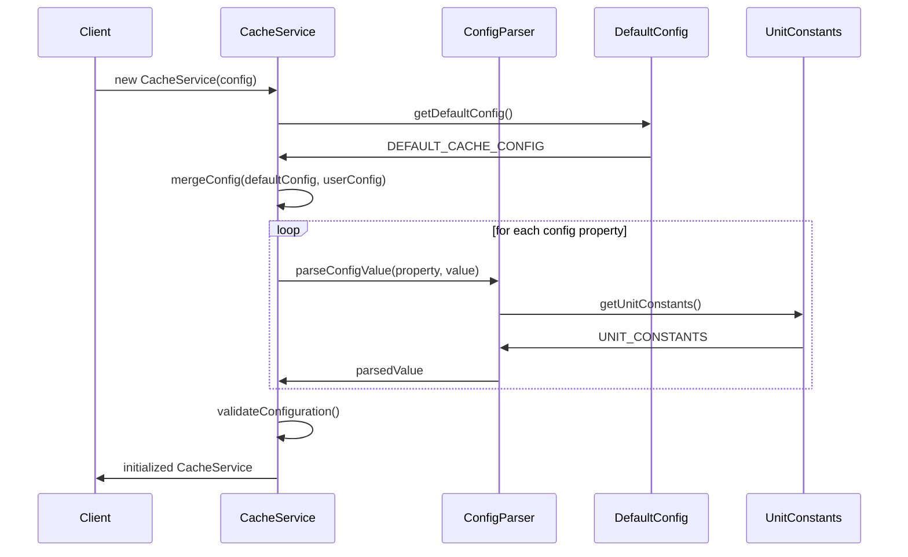
```mermaid
sequenceDiagram
    participant Client
    participant CacheService
    participant ConfigParser
    participant DefaultConfig
    participant UnitConstants

    Client->>CacheService: new CacheService(config)
    CacheService->>DefaultConfig: getDefaultConfig()
    DefaultConfig->>CacheService: DEFAULT_CACHE_CONFIG
    
    CacheService->>CacheService: mergeConfig(defaultConfig, userConfig)
    
    loop for each config property
        CacheService->>ConfigParser: parseConfigValue(property, value)
        ConfigParser->>UnitConstants: getUnitConstants()
        UnitConstants->>ConfigParser: UNIT_CONSTANTS
        ConfigParser->>CacheService: parsedValue
    end
    
    CacheService->>CacheService: validateConfiguration()
    CacheService->>Client: initialized CacheService
```

### Constructor Initialization Flow (Legacy)

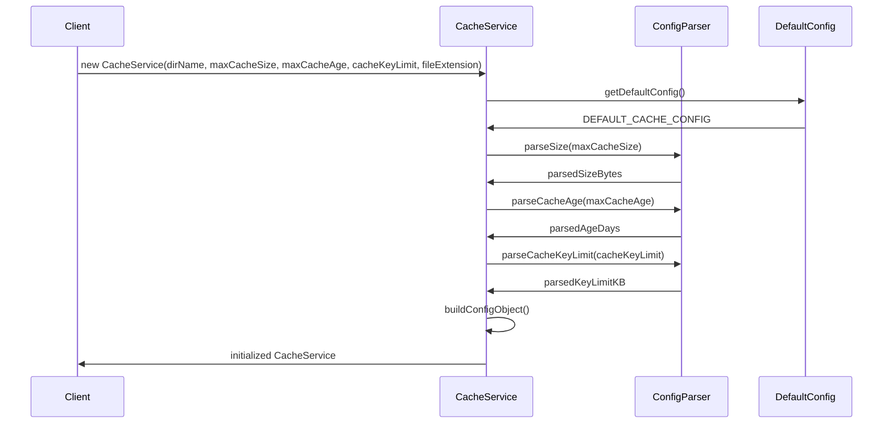
```mermaid
sequenceDiagram
    participant Client
    participant CacheService
    participant ConfigParser
    participant DefaultConfig

    Client->>CacheService: new CacheService(dirName, maxCacheSize, maxCacheAge, cacheKeyLimit, fileExtension)
    CacheService->>DefaultConfig: getDefaultConfig()
    DefaultConfig->>CacheService: DEFAULT_CACHE_CONFIG
    
    CacheService->>ConfigParser: parseSize(maxCacheSize)
    ConfigParser->>CacheService: parsedSizeBytes
    
    CacheService->>ConfigParser: parseCacheAge(maxCacheAge)
    ConfigParser->>CacheService: parsedAgeDays
    
    CacheService->>ConfigParser: parseCacheKeyLimit(cacheKeyLimit)
    ConfigParser->>CacheService: parsedKeyLimitKB
    
    CacheService->>CacheService: buildConfigObject()
    CacheService->>Client: initialized CacheService
```

### Configuration Validation Flow

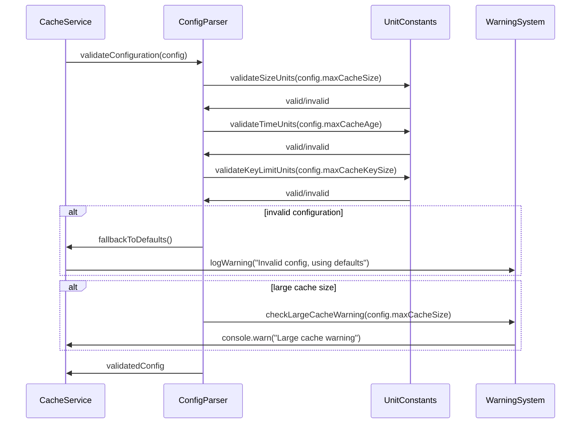
```mermaid
sequenceDiagram
    participant CacheService
    participant ConfigParser
    participant UnitConstants
    participant WarningSystem

    CacheService->>ConfigParser: validateConfiguration(config)
    
    ConfigParser->>UnitConstants: validateSizeUnits(config.maxCacheSize)
    UnitConstants->>ConfigParser: valid/invalid
    
    ConfigParser->>UnitConstants: validateTimeUnits(config.maxCacheAge)
    UnitConstants->>ConfigParser: valid/invalid
    
    ConfigParser->>UnitConstants: validateKeyLimitUnits(config.maxCacheKeySize)
    UnitConstants->>ConfigParser: valid/invalid
    
    alt invalid configuration
        ConfigParser->>CacheService: fallbackToDefaults()
        CacheService->>WarningSystem: logWarning("Invalid config, using defaults")
    end
    
    alt large cache size
        ConfigParser->>WarningSystem: checkLargeCacheWarning(config.maxCacheSize)
        WarningSystem->>CacheService: console.warn("Large cache warning")
    end
    
    ConfigParser->>CacheService: validatedConfig
```

### Set Operation Flow (with Index Updates and Configuration)

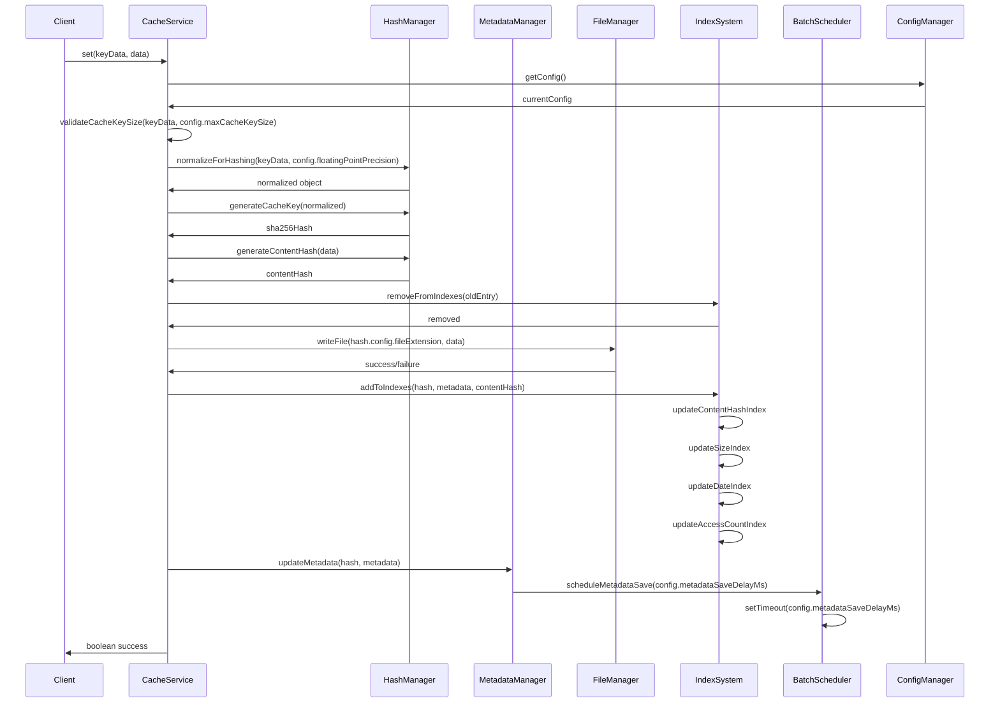
```mermaid
sequenceDiagram
    participant Client
    participant CacheService
    participant HashManager
    participant MetadataManager
    participant FileManager
    participant IndexSystem
    participant BatchScheduler
    participant ConfigManager

    Client->>CacheService: set(keyData, data)
    CacheService->>ConfigManager: getConfig()
    ConfigManager->>CacheService: currentConfig
    
    CacheService->>CacheService: validateCacheKeySize(keyData, config.maxCacheKeySize)
    
    CacheService->>HashManager: normalizeForHashing(keyData, config.floatingPointPrecision)
    HashManager->>CacheService: normalized object
    CacheService->>HashManager: generateCacheKey(normalized)
    HashManager->>CacheService: sha256Hash
    
    CacheService->>HashManager: generateContentHash(data)
    HashManager->>CacheService: contentHash
    
    CacheService->>IndexSystem: removeFromIndexes(oldEntry)
    IndexSystem->>CacheService: removed
    
    CacheService->>FileManager: writeFile(hash.config.fileExtension, data)
    FileManager->>CacheService: success/failure
    
    CacheService->>IndexSystem: addToIndexes(hash, metadata, contentHash)
    IndexSystem->>IndexSystem: updateContentHashIndex
    IndexSystem->>IndexSystem: updateSizeIndex
    IndexSystem->>IndexSystem: updateDateIndex
    IndexSystem->>IndexSystem: updateAccessCountIndex
    
    CacheService->>MetadataManager: updateMetadata(hash, metadata)
    MetadataManager->>BatchScheduler: scheduleMetadataSave(config.metadataSaveDelayMs)
    BatchScheduler->>BatchScheduler: setTimeout(config.metadataSaveDelayMs)
    
    CacheService->>Client: boolean success
```

### Get Operation Flow

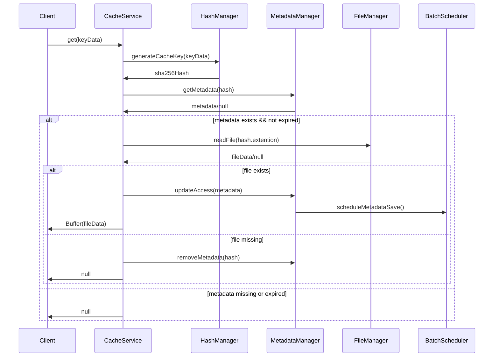
```mermaid
sequenceDiagram
    participant Client
    participant CacheService
    participant HashManager
    participant MetadataManager
    participant FileManager
    participant BatchScheduler

    Client->>CacheService: get(keyData)
    CacheService->>HashManager: generateCacheKey(keyData)
    HashManager->>CacheService: sha256Hash
    
    CacheService->>MetadataManager: getMetadata(hash)
    MetadataManager->>CacheService: metadata/null
    
    alt metadata exists && not expired
        CacheService->>FileManager: readFile(hash.extention)
        FileManager->>CacheService: fileData/null
        
        alt file exists
            CacheService->>MetadataManager: updateAccess(metadata)
            MetadataManager->>BatchScheduler: scheduleMetadataSave()
            CacheService->>Client: Buffer(fileData)
        else file missing
            CacheService->>MetadataManager: removeMetadata(hash)
            CacheService->>Client: null
        end
    else metadata missing or expired
        CacheService->>Client: null
    end
```

### Delete Operation Flow

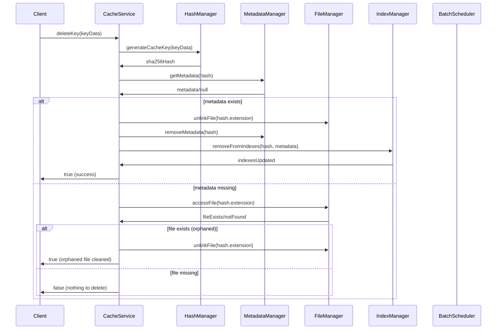
```mermaid
sequenceDiagram
    participant Client
    participant CacheService
    participant HashManager
    participant MetadataManager
    participant FileManager
    participant IndexManager
    participant BatchScheduler

    Client->>CacheService: deleteKey(keyData)
    CacheService->>HashManager: generateCacheKey(keyData)
    HashManager->>CacheService: sha256Hash
    
    CacheService->>MetadataManager: getMetadata(hash)
    MetadataManager->>CacheService: metadata/null
    
    alt metadata exists
        CacheService->>FileManager: unlinkFile(hash.extension)
        CacheService->>MetadataManager: removeMetadata(hash)
        CacheService->>IndexManager: removeFromIndexes(hash, metadata)
        IndexManager->>CacheService: indexesUpdated
        CacheService->>Client: true (success)
    else metadata missing
        CacheService->>FileManager: accessFile(hash.extension)
        FileManager->>CacheService: fileExists/notFound
        
        alt file exists (orphaned)
            CacheService->>FileManager: unlinkFile(hash.extension)
            CacheService->>Client: true (orphaned file cleaned)
        else file missing
            CacheService->>Client: false (nothing to delete)
        end
    end
```

## Search Operations

### Content-Based Search Flow (Index-Based)

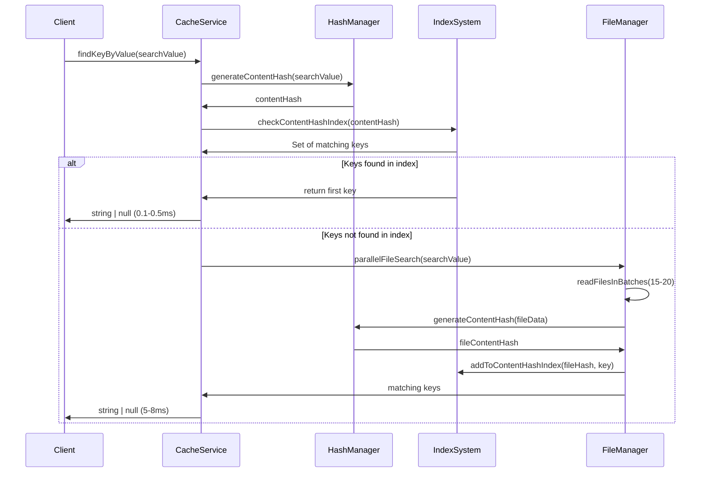
```mermaid
sequenceDiagram
    participant Client
    participant CacheService
    participant HashManager
    participant IndexSystem
    participant FileManager

    Client->>CacheService: findKeyByValue(searchValue)
    CacheService->>HashManager: generateContentHash(searchValue)
    HashManager->>CacheService: contentHash
    
    CacheService->>IndexSystem: checkContentHashIndex(contentHash)
    IndexSystem->>CacheService: Set of matching keys
    
    alt Keys found in index
        IndexSystem->>CacheService: return first key
        CacheService->>Client: string | null (0.1-0.5ms)
    else Keys not found in index
        CacheService->>FileManager: parallelFileSearch(searchValue)
        FileManager->>FileManager: readFilesInBatches(15-20)
        FileManager->>HashManager: generateContentHash(fileData)
        HashManager->>FileManager: fileContentHash
        FileManager->>IndexSystem: addToContentHashIndex(fileHash, key)
        FileManager->>CacheService: matching keys
        CacheService->>Client: string | null (5-8ms)
    end
```

### Multi-Dimensional Search Flows

#### Size-Based Search

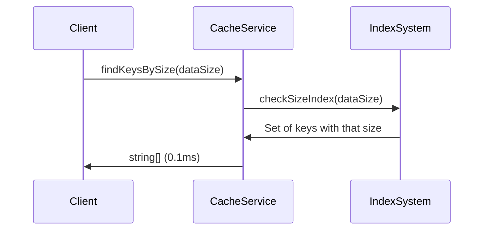
```mermaid
sequenceDiagram
    participant Client
    participant CacheService
    participant IndexSystem

    Client->>CacheService: findKeysBySize(dataSize)
    CacheService->>IndexSystem: checkSizeIndex(dataSize)
    IndexSystem->>CacheService: Set of keys with that size
    CacheService->>Client: string[] (0.1ms)
```

#### Date-Based Search

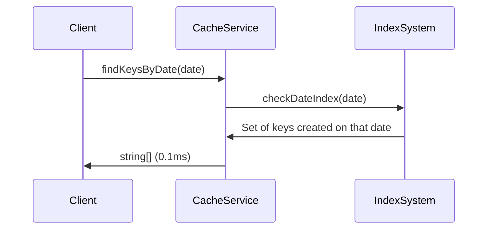
```mermaid
sequenceDiagram
    participant Client
    participant CacheService
    participant IndexSystem

    Client->>CacheService: findKeysByDate(date)
    CacheService->>IndexSystem: checkDateIndex(date)
    IndexSystem->>CacheService: Set of keys created on that date
    CacheService->>Client: string[] (0.1ms)
```

#### Access Count Search

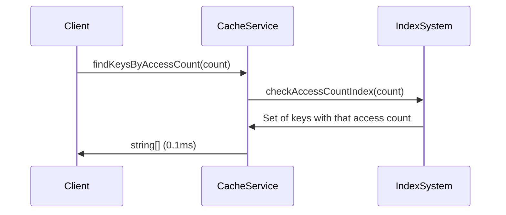
```mermaid
sequenceDiagram
    participant Client
    participant CacheService
    participant IndexSystem

    Client->>CacheService: findKeysByAccessCount(count)
    CacheService->>IndexSystem: checkAccessCountIndex(count)
    IndexSystem->>CacheService: Set of keys with that access count
    CacheService->>Client: string[] (0.1ms)
```

## Configuration Operations

### Runtime Configuration Update Flow

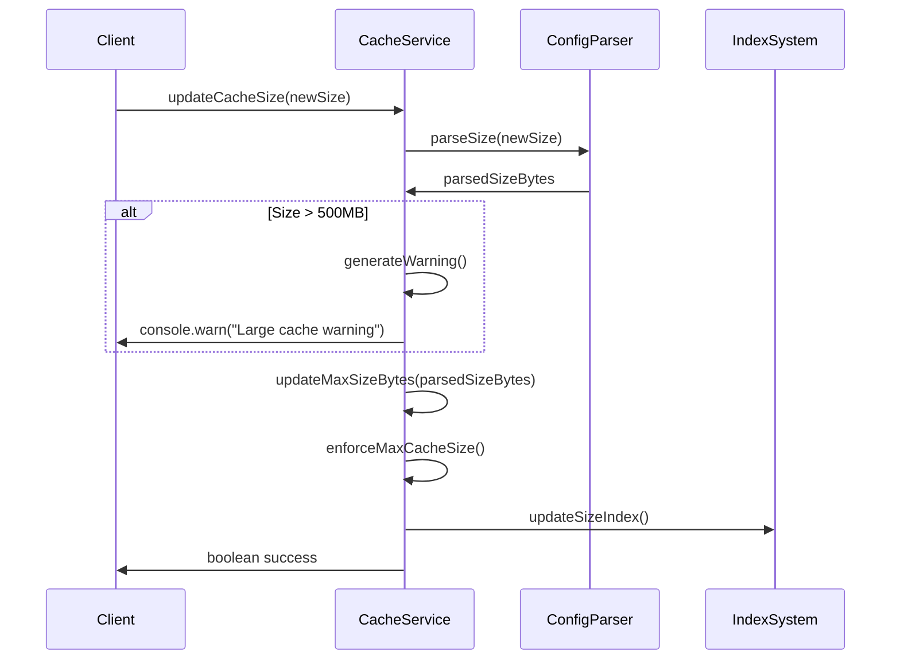
```mermaid
sequenceDiagram
    participant Client
    participant CacheService
    participant ConfigParser
    participant IndexSystem

    Client->>CacheService: updateCacheSize(newSize)
    CacheService->>ConfigParser: parseSize(newSize)
    ConfigParser->>CacheService: parsedSizeBytes
    
    alt Size > 500MB
        CacheService->>CacheService: generateWarning()
        CacheService->>Client: console.warn("Large cache warning")
    end
    
    CacheService->>CacheService: updateMaxSizeBytes(parsedSizeBytes)
    CacheService->>CacheService: enforceMaxCacheSize()
    CacheService->>IndexSystem: updateSizeIndex()
    CacheService->>Client: boolean success
```

### Configuration Display Flow

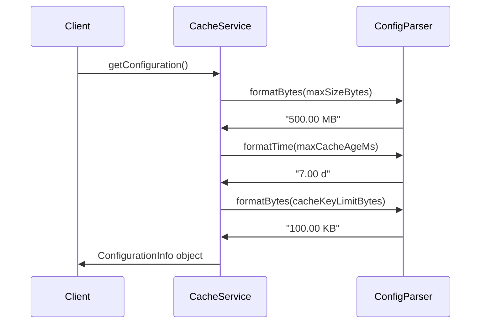
```mermaid
sequenceDiagram
    participant Client
    participant CacheService
    participant ConfigParser

    Client->>CacheService: getConfiguration()
    CacheService->>ConfigParser: formatBytes(maxSizeBytes)
    ConfigParser->>CacheService: "500.00 MB"
    CacheService->>ConfigParser: formatTime(maxCacheAgeMs)
    ConfigParser->>CacheService: "7.00 d"
    CacheService->>ConfigParser: formatBytes(cacheKeyLimitBytes)
    ConfigParser->>CacheService: "100.00 KB"
    CacheService->>Client: ConfigurationInfo object
```

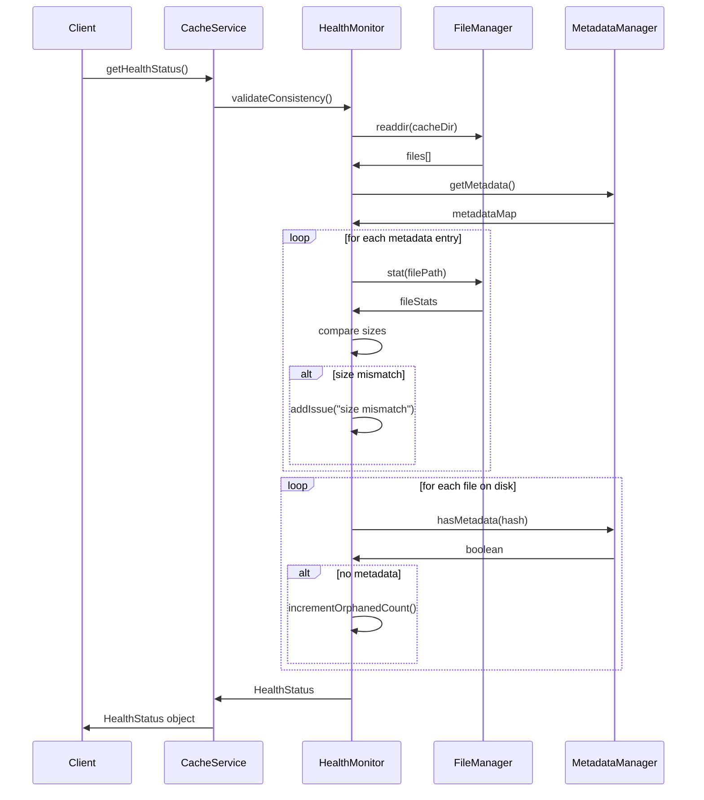
```mermaid
sequenceDiagram
    participant Client
    participant CacheService
    participant HealthMonitor
    participant FileManager
    participant MetadataManager

    Client->>CacheService: getHealthStatus()
    CacheService->>HealthMonitor: validateConsistency()
    
    HealthMonitor->>FileManager: readdir(cacheDir)
    FileManager->>HealthMonitor: files[]
    
    HealthMonitor->>MetadataManager: getMetadata()
    MetadataManager->>HealthMonitor: metadataMap
    
    loop for each metadata entry
        HealthMonitor->>FileManager: stat(filePath)
        FileManager->>HealthMonitor: fileStats
        HealthMonitor->>HealthMonitor: compare sizes
        
        alt size mismatch
            HealthMonitor->>HealthMonitor: addIssue("size mismatch")
        end
    end
    
    loop for each file on disk
        HealthMonitor->>MetadataManager: hasMetadata(hash)
        MetadataManager->>HealthMonitor: boolean
        
        alt no metadata
            HealthMonitor->>HealthMonitor: incrementOrphanedCount()
        end
    end
    
    HealthMonitor->>CacheService: HealthStatus
    CacheService->>Client: HealthStatus object
```

## Background Operations

### Cleanup Operation Flow

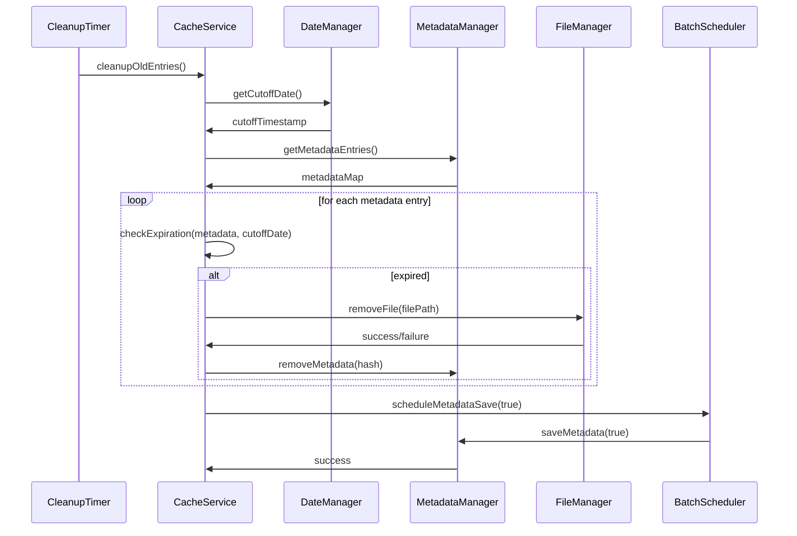
```mermaid
sequenceDiagram
    participant CleanupTimer
    participant CacheService
    participant DateManager
    participant MetadataManager
    participant FileManager
    participant BatchScheduler

    CleanupTimer->>CacheService: cleanupOldEntries()
    CacheService->>DateManager: getCutoffDate()
    DateManager->>CacheService: cutoffTimestamp
    
    CacheService->>MetadataManager: getMetadataEntries()
    MetadataManager->>CacheService: metadataMap
    
    loop for each metadata entry
        CacheService->>CacheService: checkExpiration(metadata, cutoffDate)
        
        alt expired
            CacheService->>FileManager: removeFile(filePath)
            FileManager->>CacheService: success/failure
            CacheService->>MetadataManager: removeMetadata(hash)
        end
    end
    
    CacheService->>BatchScheduler: scheduleMetadataSave(true)
    BatchScheduler->>MetadataManager: saveMetadata(true)
    MetadataManager->>CacheService: success
```

### Batch Metadata Save Flow (with Configuration)

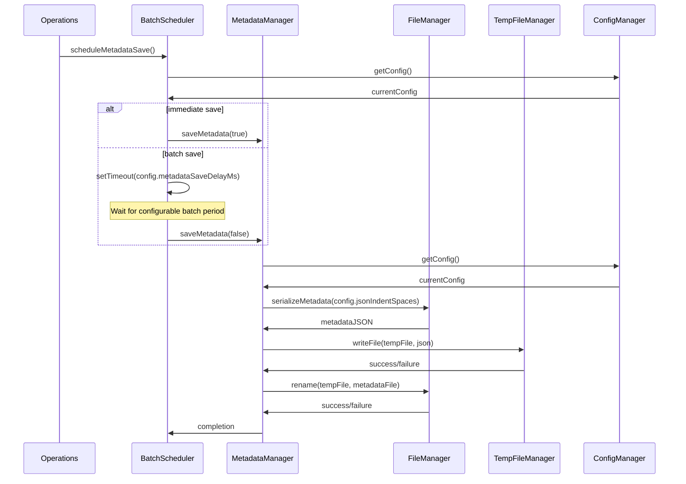
```mermaid
sequenceDiagram
    participant Operations
    participant BatchScheduler
    participant MetadataManager
    participant FileManager
    participant TempFileManager
    participant ConfigManager

    Operations->>BatchScheduler: scheduleMetadataSave()
    BatchScheduler->>ConfigManager: getConfig()
    ConfigManager->>BatchScheduler: currentConfig
    
    alt immediate save
        BatchScheduler->>MetadataManager: saveMetadata(true)
    else batch save
        BatchScheduler->>BatchScheduler: setTimeout(config.metadataSaveDelayMs)
        Note over BatchScheduler: Wait for configurable batch period
        
        BatchScheduler->>MetadataManager: saveMetadata(false)
    end
    
    MetadataManager->>ConfigManager: getConfig()
    ConfigManager->>MetadataManager: currentConfig
    
    MetadataManager->>FileManager: serializeMetadata(config.jsonIndentSpaces)
    FileManager->>MetadataManager: metadataJSON
    
    MetadataManager->>TempFileManager: writeFile(tempFile, json)
    TempFileManager->>MetadataManager: success/failure
    
    MetadataManager->>FileManager: rename(tempFile, metadataFile)
    FileManager->>MetadataManager: success/failure
    
    MetadataManager->>BatchScheduler: completion
```

## Error Handling Flows

### Graceful Shutdown Flow

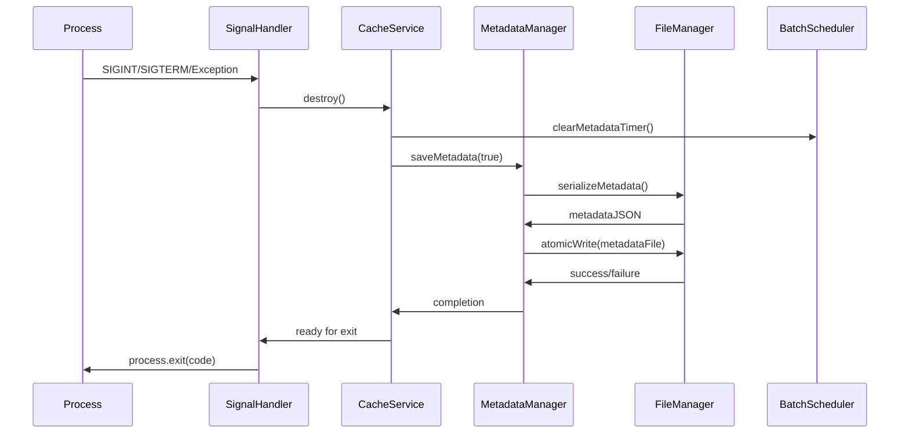
```mermaid
sequenceDiagram
    participant Process
    participant SignalHandler
    participant CacheService
    participant MetadataManager
    participant FileManager

    Process->>SignalHandler: SIGINT/SIGTERM/Exception
    SignalHandler->>CacheService: destroy()
    
    CacheService->>BatchScheduler: clearMetadataTimer()
    CacheService->>MetadataManager: saveMetadata(true)
    
    MetadataManager->>FileManager: serializeMetadata()
    FileManager->>MetadataManager: metadataJSON
    
    MetadataManager->>FileManager: atomicWrite(metadataFile)
    FileManager->>MetadataManager: success/failure
    
    MetadataManager->>CacheService: completion
    CacheService->>SignalHandler: ready for exit
    SignalHandler->>Process: process.exit(code)
```

### Error Recovery Flow

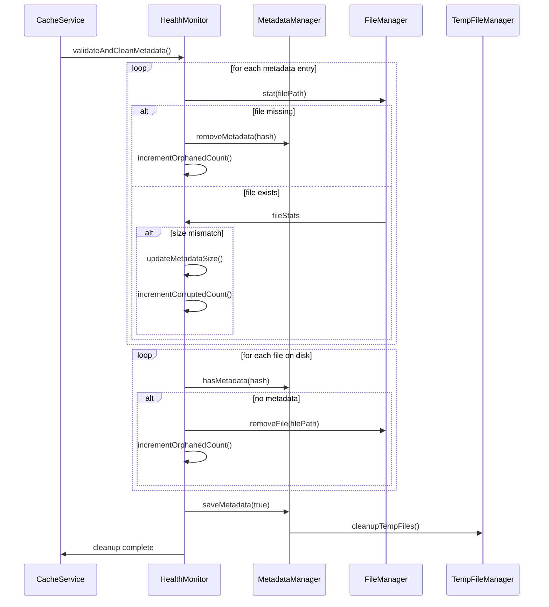
```mermaid
sequenceDiagram
    participant CacheService
    participant HealthMonitor
    participant MetadataManager
    participant FileManager
    participant TempFileManager

    CacheService->>HealthMonitor: validateAndCleanMetadata()
    
    loop for each metadata entry
        HealthMonitor->>FileManager: stat(filePath)
        
        alt file missing
            HealthMonitor->>MetadataManager: removeMetadata(hash)
            HealthMonitor->>HealthMonitor: incrementOrphanedCount()
        else file exists
            FileManager->>HealthMonitor: fileStats
            
            alt size mismatch
                HealthMonitor->>HealthMonitor: updateMetadataSize()
                HealthMonitor->>HealthMonitor: incrementCorruptedCount()
            end
        end
    end
    
    loop for each file on disk
        HealthMonitor->>MetadataManager: hasMetadata(hash)
        
        alt no metadata
            HealthMonitor->>FileManager: removeFile(filePath)
            HealthMonitor->>HealthMonitor: incrementOrphanedCount()
        end
    end
    
    HealthMonitor->>MetadataManager: saveMetadata(true)
    MetadataManager->>TempFileManager: cleanupTempFiles()
    
    HealthMonitor->>CacheService: cleanup complete
```

## Advanced Operations

### Search by Value Flow

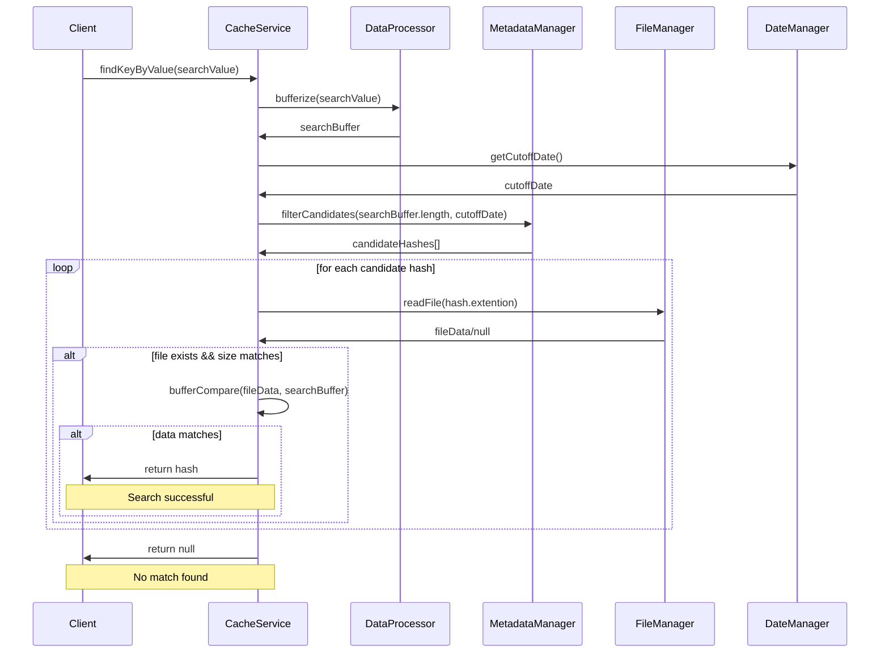
```mermaid
sequenceDiagram
    participant Client
    participant CacheService
    participant DataProcessor
    participant MetadataManager
    participant FileManager

    Client->>CacheService: findKeyByValue(searchValue)
    CacheService->>DataProcessor: bufferize(searchValue)
    DataProcessor->>CacheService: searchBuffer
    
    CacheService->>DateManager: getCutoffDate()
    DateManager->>CacheService: cutoffDate
    
    CacheService->>MetadataManager: filterCandidates(searchBuffer.length, cutoffDate)
    MetadataManager->>CacheService: candidateHashes[]
    
    loop for each candidate hash
        CacheService->>FileManager: readFile(hash.extention)
        FileManager->>CacheService: fileData/null
        
        alt file exists && size matches
            CacheService->>CacheService: bufferCompare(fileData, searchBuffer)
            
            alt data matches
                CacheService->>Client: return hash
                Note over CacheService,Client: Search successful
            end
        end
    end
    
    CacheService->>Client: return null
    Note over CacheService,Client: No match found
```

### Size Enforcement Flow

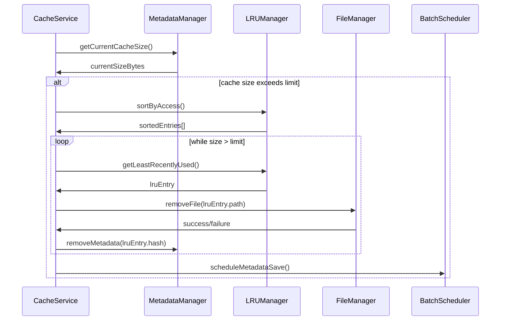
```mermaid
sequenceDiagram
    participant CacheService
    participant MetadataManager
    participant LRUManager
    participant FileManager
    participant BatchScheduler

    CacheService->>MetadataManager: getCurrentCacheSize()
    MetadataManager->>CacheService: currentSizeBytes
    
    alt cache size exceeds limit
        CacheService->>LRUManager: sortByAccess()
        LRUManager->>CacheService: sortedEntries[]
        
        loop while size > limit
            CacheService->>LRUManager: getLeastRecentlyUsed()
            LRUManager->>CacheService: lruEntry
            
            CacheService->>FileManager: removeFile(lruEntry.path)
            FileManager->>CacheService: success/failure
            
            CacheService->>MetadataManager: removeMetadata(lruEntry.hash)
        end
        
        CacheService->>BatchScheduler: scheduleMetadataSave()
    end
```

These sequence diagrams illustrate the complex interactions between components during cache operations, showing how the system maintains consistency, handles errors gracefully, and optimizes performance through batching and background operations.
