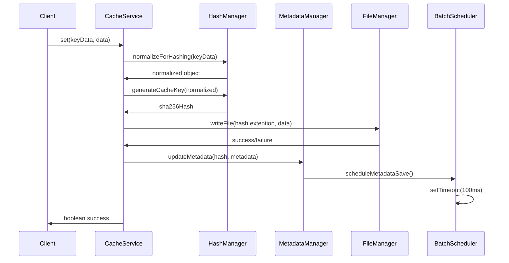
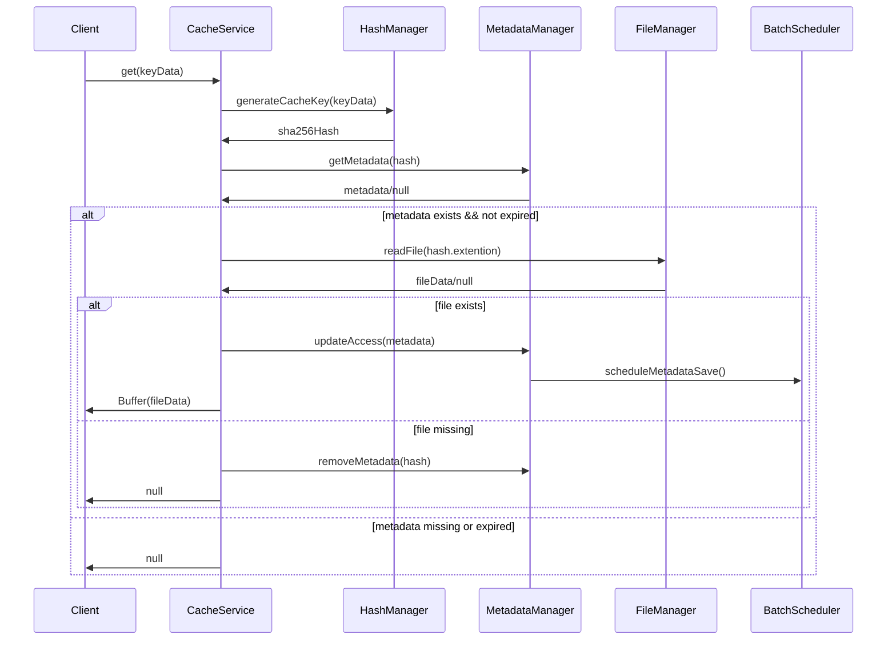
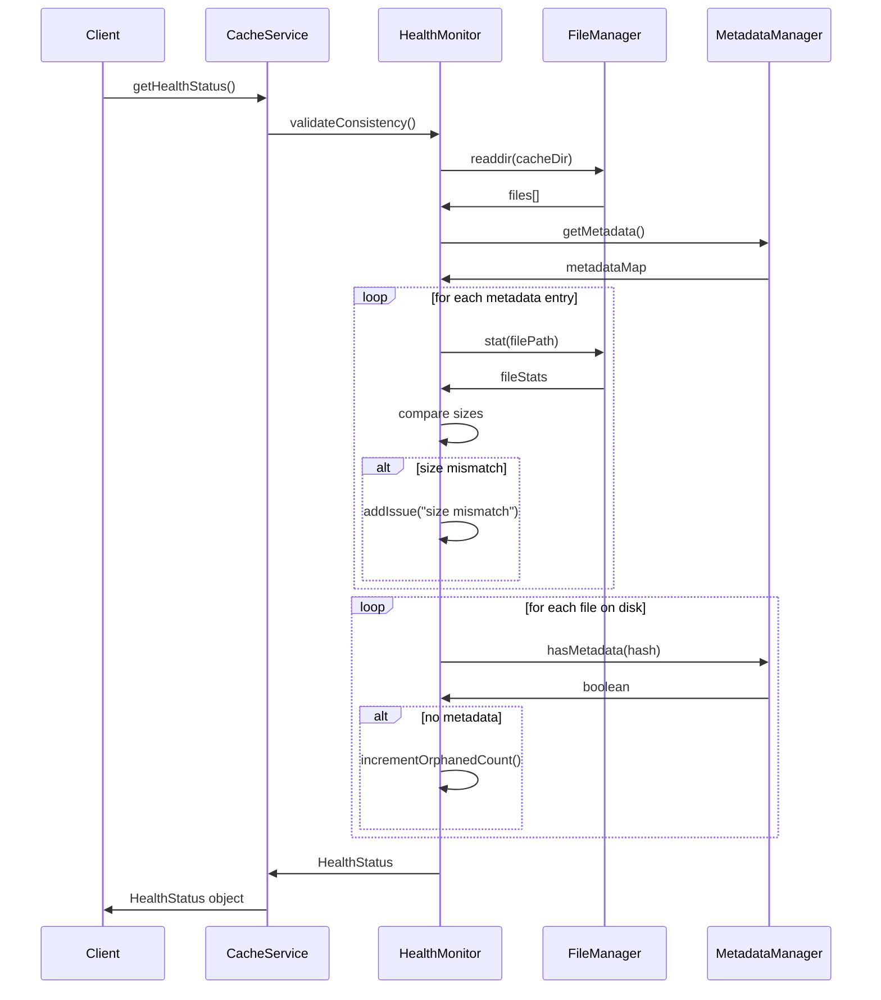
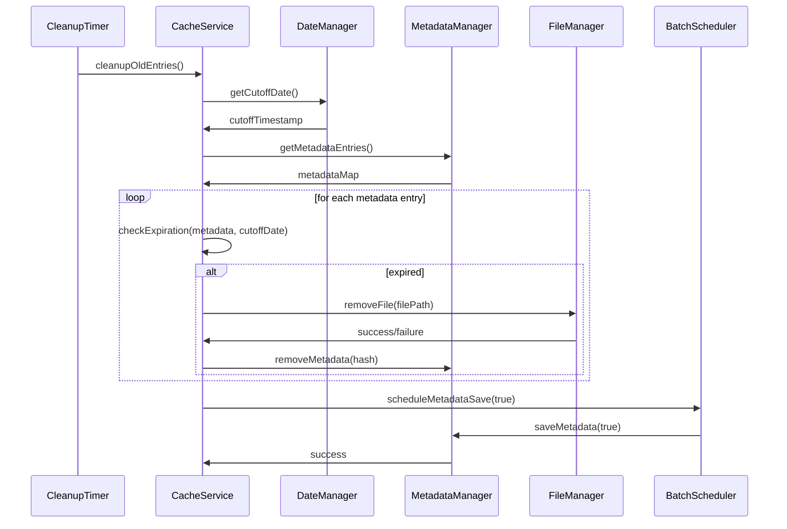
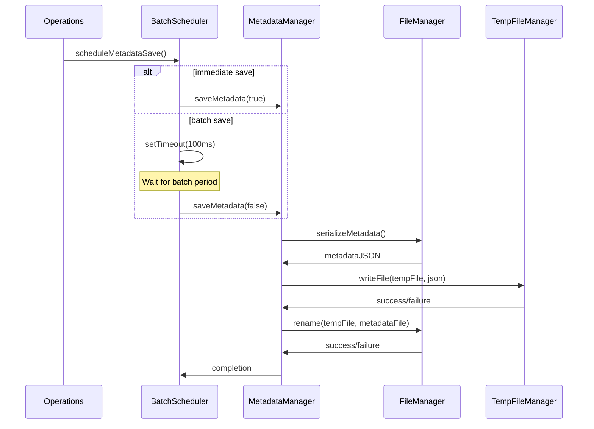
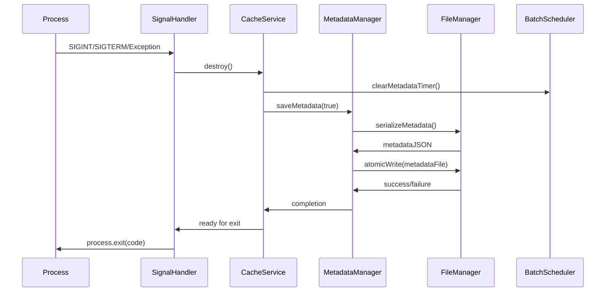
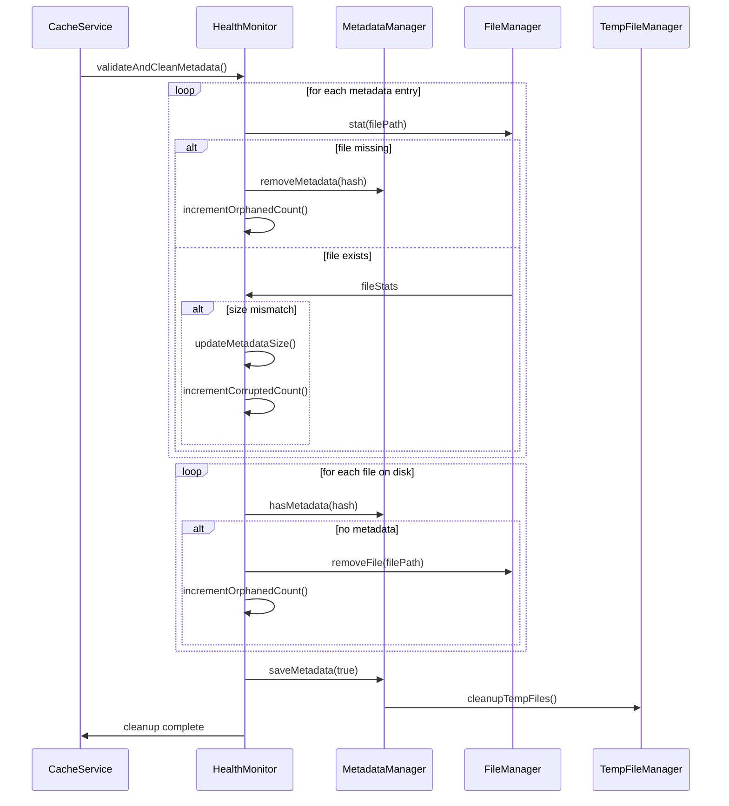
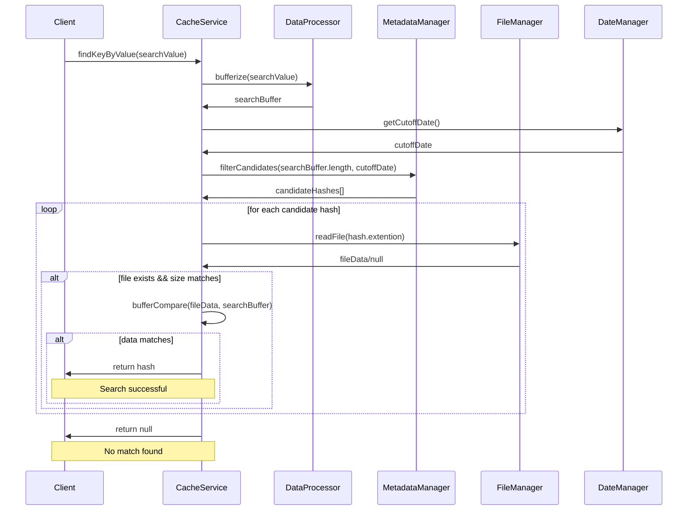
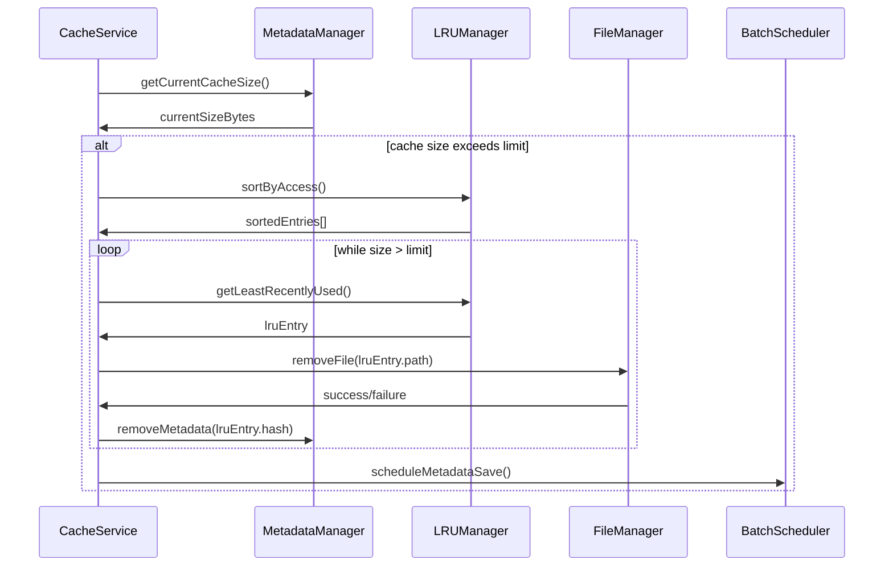

# DiskyCache Operations

This document provides detailed sequence diagrams and operation flows for DiskyCache functionality.

## Core Operations Overview

The cache system operates through several key workflows that handle data storage, retrieval, cleanup, and health monitoring.

## Primary Operations

### Set Operation Flow

### Get Operation Flow

### Health Check Operation Flow

## Background Operations

### Cleanup Operation Flow

### Batch Metadata Save Flow

## Error Handling Flows

### Graceful Shutdown Flow

### Error Recovery Flow

## Advanced Operations

### Search by Value Flow

### Size Enforcement Flow

These sequence diagrams illustrate the complex interactions between components during cache operations, showing how the system maintains consistency, handles errors gracefully, and optimizes performance through batching and background operations.
